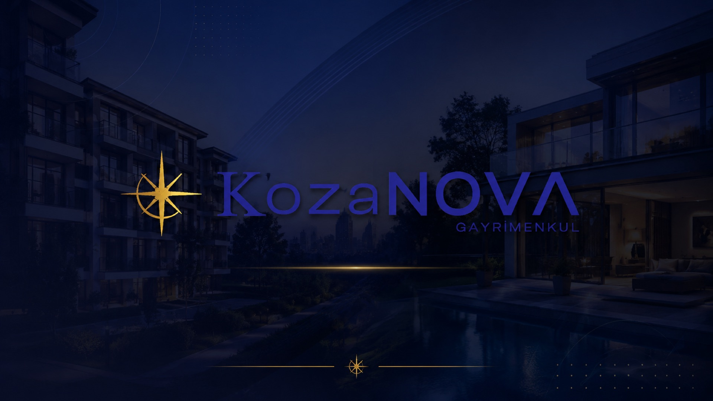

<p align="center">
  
</p>

<h1 align="center">KozaNOVA Gayrimenkul</h1>

<p align="center">
  <strong>Emlağın Parlayan Yıldızı</strong>
  <br><br>
  <a href="https://kozanovagayrimenkul.com">🌐 kozanovagayrimenkul.com</a>
</p>

---

## 📋 İçindekiler

- [Proje Hakkında](#-proje-hakkında)
- [Sayfalar](#-sayfalar)
- [Önizleme](#-önizleme)
- [Özellikler](#-özellikler)
- [Teknik Altyapı](#-teknik-altyapı)
- [Dosya Yapısı](#-dosya-yapısı)

---

## 🏠 Proje Hakkında

**KozaNOVA Gayrimenkul**, Kocaeli merkezli bir gayrimenkul danışmanlık firmasının kurumsal web sitesidir. 2024 yılından bu yana Kocaeli başta olmak üzere İstanbul bölgesinde satılık ve kiralık prestijli gayrimenkuller için danışmanlık hizmeti sunmaktadır.

Site, tamamen statik HTML/CSS/JavaScript ile geliştirilmiş olup, herhangi bir harici bağımlılık gerektirmeden çalışmaktadır. Türkçe ve İngilizce olmak üzere çift dil desteği sunar.

---

## 📄 Sayfalar

| Sayfa | Açıklama | Link |
|-------|----------|------|
| **Ana Sayfa** | Firma tanıtımı, öne çıkan ilanlar, referanslar | [index.html](index.html) |
| **Hakkımızda** | Vizyon, misyon, firma geçmişi ve değerlerimiz | [hakkimizda.html](hakkimizda.html) |
| **Hizmetler** | Sunulan gayrimenkul danışmanlık hizmetleri | [hizmetler.html](hizmetler.html) |
| **İlanlar** | Satılık ve kiralık gayrimenkul listeleri | [ilanlar.html](ilanlar.html) |
| **İletişim** | İletişim formu, adres ve harita | [iletisim.html](iletisim.html) |

---

## 🖼 Önizleme

### Ana Sayfa


### Hakkımızda


---

## ✨ Özellikler

- ✅ **Çift Dil Desteği** — Tek tıkla Türkçe/İngilizce geçiş
- ✅ **Karanlık Mod** — Aydınlık/karanlık tema desteği
- ✅ **Responsive Tasarım** — Mobil, tablet ve desktop uyumlu
- ✅ **İletişim Formu** — Netlify Forms entegrasyonu ile çalışan form
- ✅ **Yandex Harita** — Ofis konumu interaktif harita ile gösterimi
- ✅ **Modern Animasyonlar** — Scroll tabanlı görünüm efektleri
- ✅ **SEO Dostu** — Semantic HTML yapısı
- ✅ **Hızlı Yükleme** — Harici bağımlılık yok, optimize edilmiş görseller

---

## 🛠 Teknik Altyapı

| Kategori | Kullanılan Teknoloji |
|----------|---------------------|
| **Frontend** | HTML5, CSS3, JavaScript (Vanilla) |
| **Dil Sistemi** | `js/translations.js` ile JSON tabanlı çoklu dil desteği |
| **Tema** | CSS değişkenleri ile aydınlık/karanlık tema |
| **Tasarım** | Responsive grid/flexbox, modern gradientler |
| **Harita** | Yandex Haritalar API (iframe entegrasyonu) |
| **Form** | Netlify Forms (spam korumalı) |
| **Font** | Google Fonts — Playfair Display, Plus Jakarta Sans |
| **İkonlar** | Unicode/emoji tabanlı (harici kütüphane yok) |
| **Barındırma** | Netlify (uyumlu statik yapı) |
| **Sürüm Kontrol** | Git & GitHub |

---

## 📁 Dosya Yapısı

```
kozanova/
├── index.html            # Ana sayfa
├── hakkimizda.html       # Hakkımızda sayfası
├── hizmetler.html        # Hizmetler sayfası
├── ilanlar.html          # İlanlar sayfası
├── iletisim.html         # İletişim sayfası
├── style.css             # Ana stil dosyası (tema değişkenleri + responsive)
├── script.js             # Ana JS dosyası (dil, tema, animasyonlar)
├── translations.js       # Çoklu dil çeviri dosyası (Türkçe / İngilizce)
├── css/
│   └── style.css             # Ana stil dosyası (tema değişkenleri + responsive)
├── js/
│   ├── script.js             # Ana JS dosyası (dil, tema, animasyonlar)
│   └── translations.js       # Çoklu dil çeviri dosyası (Türkçe / İngilizce)
├── images/
│   ├── logo.png          # Firma logosu
│   ├── favicon.png       # Tarayıcı favicon
│   ├── hero-bg.jpg       # Ana sayfa hero görseli
│   ├── about-office.jpg  # Hakkımızda ofis görseli
│   ├── team-berat.jpeg   # Ekip: Berat Korkmaz
│   ├── team-hasan.jpeg   # Ekip: Hasan Korkmaz
│   ├── project-darica.jpeg
│   ├── project-izmit.jpeg
│   ├── project-gebze.jpeg
│   ├── project-korfez.jpeg
│   ├── project-kartepe.jpeg
│   ├── project-basiskele.jpeg
│   └── ...               # Diğer görseller
└── README.md             # Bu dosya
```

---

<p align="center">
  <sub>© 2024 KozaNOVA Gayrimenkul — Tüm hakları saklıdır.</sub>
  <br>
  <sub>Built with ❤️ in Kocaeli</sub>
</p>
